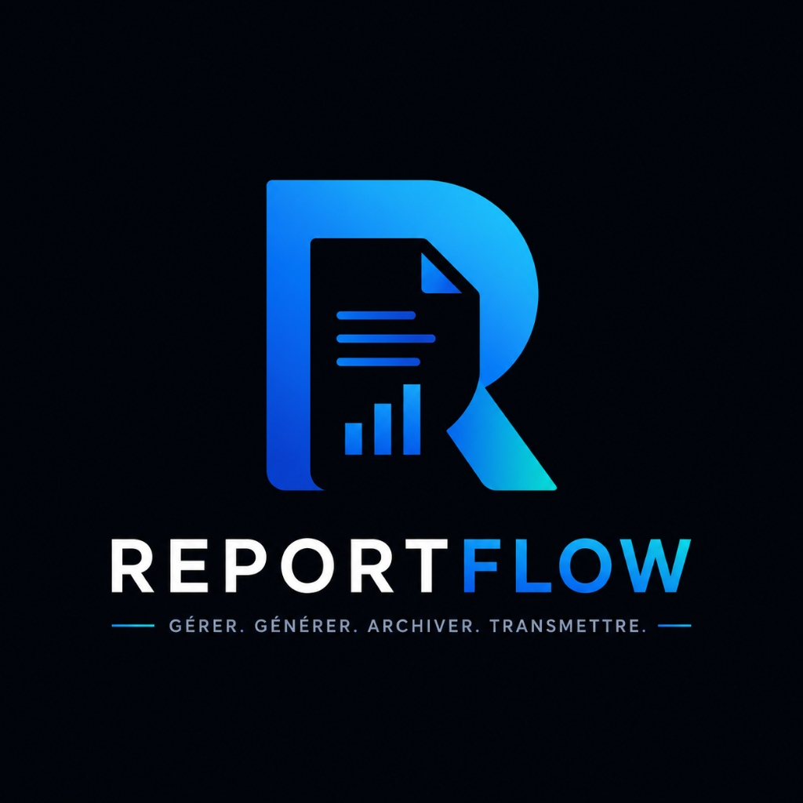

<div align="center">
  
  <h1>ReportFlow</h1>
  <p><strong>Plateforme SaaS Intelligente de Gestion et d'Archivage de Rapports Administratifs</strong></p>
</div>

---

## 📖 À propos du projet (About the Project)

**ReportFlow** est une plateforme SaaS (Software as a Service) multi-tenant conçue pour la gestion, la génération assistée par IA, et l'archivage sécurisé de rapports administratifs. Elle s'adresse aux délégations, services régionaux, et grandes organisations nécessitant une traçabilité intégrale, des preuves immuables et une automatisation de la rédaction de rapports périodiques.

## ✨ Fonctionnalités Principales (Key Features)

- 🏢 **Architecture Multi-Tenant** : Isolation complète des données par organisation (délégation/service) via un système de sous-domaines (`X-Tenant-Slug`).
- 🤖 **Synthèse Assistée par IA** : Génération automatisée de rapports à partir des activités journalières enregistrées par les agents, avec gestion des statuts de brouillon, de soumission et d'approbation.
- 🔒 **Archivage Immuable (Coffre-Fort)** : Les rapports approuvés sont archivés avec une empreinte cryptographique (hash SHA-256). Toute modification ou suppression ultérieure est bloquée au niveau de la base de données pour garantir une traçabilité à valeur probatoire.
- 👥 **Gestion des Rôles (RBAC)** : Niveaux d'accès granulaires :
  - **AGENT** : Saisie d'activités.
  - **MANAGER** : Validation et génération de rapports.
  - **ADMIN_TENANT** : Administration de l'organisation.
  - **SUPERADMIN** : Administration globale et création de nouveaux locataires (tenants).
- 🎨 **Interface Premium Glassmorphism** : Interface utilisateur moderne, réactive et fluide utilisant des effets de verre dépoli, des dégradés profonds bleutés et un thème sombre professionnel.

## 🛠️ Stack Technique (Tech Stack)

### Frontend (Client)
- **Framework** : [Next.js 14](https://nextjs.org/) (App Router)
- **Bibliothèque UI** : React
- **Stylisation** : Tailwind CSS (Vanilla CSS pour les variables de thème Glassmorphism)
- **Gestion d'État** : Zustand
- **Requêtes API** : Axios

### Backend (Serveur API)
- **Framework** : [Laravel 11](https://laravel.com/)
- **Base de Données** : MySQL (via WAMP Server)
- **Authentification** : Laravel Sanctum (Tokens API)
- **Architecture** : API RESTful avec middleware de résolution de locataire (Tenant)

## 🚀 Installation Locale (Local Setup)

### Prérequis
- [WAMP Server](https://www.wampserver.com/) avec MySQL 8+ et PHP 8.2+
- [Node.js](https://nodejs.org/) v18+
- [Composer](https://getcomposer.org/)

### 1. Configuration du Backend (Laravel)
```bash
cd backend
composer install
cp .env.example .env
php artisan key:generate
```
*Assurez-vous que votre WAMP Server est lancé et que la base de données `reportflow` est créée.*
```bash
php artisan migrate:fresh --seed
php artisan serve
```

### 2. Configuration du Frontend (Next.js)
```bash
cd frontend
npm install
npm run dev
```
L'application sera accessible sur `http://localhost:3000`.

## 🧪 Données de Démonstration

La base de données est pré-configurée (seeding) avec une organisation de test (`delegation-regionale`) et les accès suivants (Mot de passe commun : `password`) :
- **Agent** : `agent@reportflow.io`
- **Manager** : `manager@reportflow.io`
- **Admin Tenant** : `admin@reportflow.io`

Un accès Super-Administrateur global est également généré :
- **SuperAdmin** : `superadmin@reportflow.io` / Mot de passe : `SuperAdmin_Secure#2026!`

---
*Développé pour la gestion administrative de nouvelle génération.*
